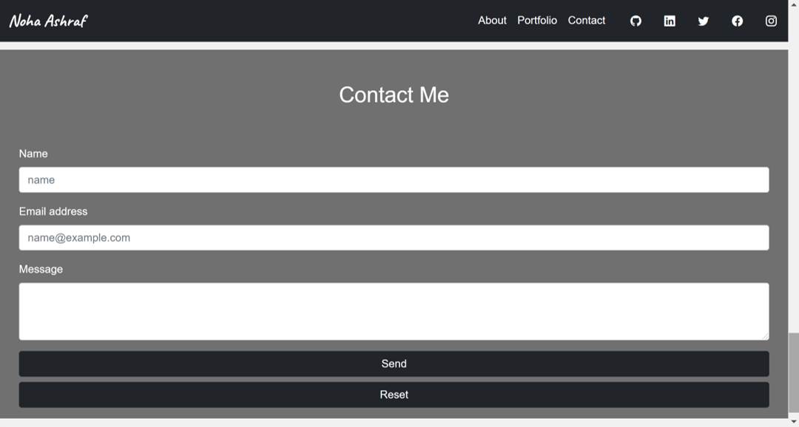

# Portfolio
## Description
My Portfolio application is created as a mobile first applicaiton with an easy navigation approach and a clean user interface.

My Portfolio can be accessed through: [Portfolio](https://nohaashraf85.github.io/MyPortfolio_NohaAshraf/)

## Table of Contents

[Description](#description)

[Technologies-&-tools-used](#Technologies-Used)

[How-it-Works](#How-it-Works)

[License](#License)

[Badges](#Badges)

[Contributing](#contributing)

[Tests](#tests)

[Questions](#questions)

## Technologies Used:
1. HTML
2. Bootstrap 5
3. CSS

## How It works: 
Upon opening the application the user is presented with a clean nav bar and a hero image that is presenting the website with a clean introduction section along with a button to go directly to the section where the user can view the work portfolio section.

The Nav Bar also includes links to all the relevant social  websites:
* GitHub
* Facebook
* Instagram
* LinkedIn
* Twitter

If the user chooses to click on View my Work Button, the user will be redirected to the work portfolio section.

The user can go back to the homepage by clicking on the Nav Bar logo.

If the user wishes to view the About section, clicking on the About in the Nav Bar shall redirect the user to the relevant section. Where information about me is presented along with contact information and a link to download my resume in PDF format.

The application provides a simple section that furnishes the technologies and tools that the portfolio owner has knowledge of.

The application also, provides a contact section where the user can contact me, this is a future development to actually send e-mail with a request. 

The Contact Me section also provides the capability of sending an e-mail directly through the website which opens the mail to window and fills in the subject and the body of the e-mail with the contact information and the message. The user can also reset the fields in the form using the reset button.

## License

## Badges

## Contributing 

To contribute to this project, please make sure you follow the guidelines in [The Contributor Covenant](https://www.contributor-covenant.org/) as general guidelines.
Kindly maintain the highest ethics and respect. For further questions or requests kindly contact me through my [Email](mailto:noha_ashraf85@hotmail.com) or [GitHub](https://github.com/NohaAshraf85).

## Tests
The application has been tested on the browser and on multiple devices to test the responsiveness.

## Questions
For any questions, please contact me through [GitHub](https://github.com/NohaAshraf85) 
or [Email](mailto:noha_ashraf85@hotmail.com)